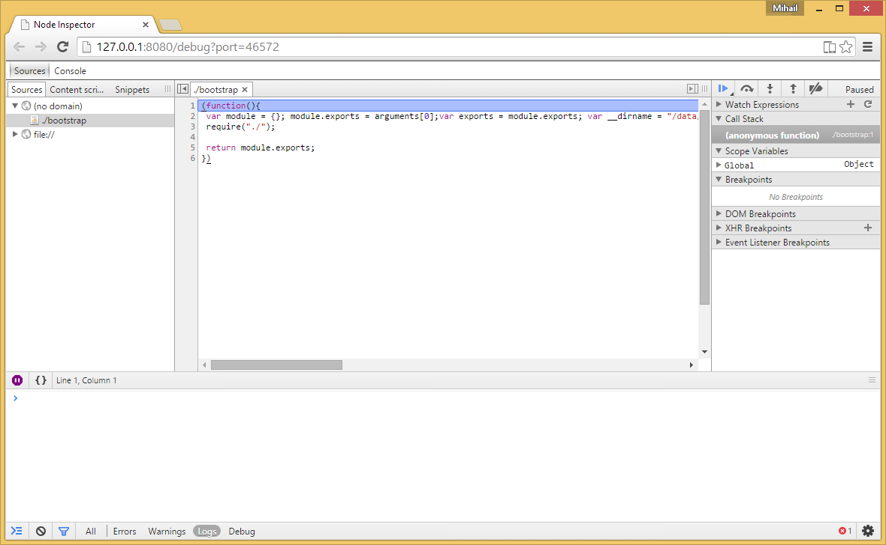

# Overview

NativeScript for Android provides support for JavaScript debugging. The current implentation supports two major scenarios.
  * Start debugging - starts an application with debugger enabled
  * Attach/Detach debugger - attach/detach debuggger to a running application

# Start an application with debugger enabled

The following command with build, deploy and run the application with attached debugger. This will allow you to debug your application from the first JavaScript statement.

```bash
tns debug andorid --debug-brk
```



# Attach/detach debugger

If you have a running application you can attach/detach debugger with the following commands.

```bash
tns debug andorid --start
```
```bash
tns debug andorid --stop
```

# Miscellaneous

You can check whether a debugger is enabled with the following command.

```bash
tns debug andorid --get-port
```

It will return the current debugger port, 0 otherwise.

# Remarks

Current implementation has hard-coded 30 seconds timeout for establishing connection between the commnad line tool and the device/emulator.
